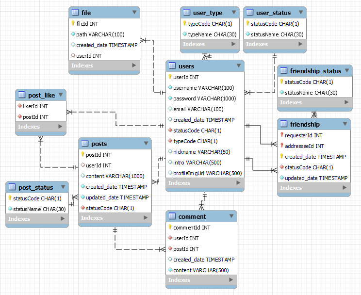

# SNSUS - Social Media App Server (BE)

## Built With

- [TypeScript](https://www.typescriptlang.org/)
- [ExpressJS](https://expressjs.com/)
- [Routing Controllers](https://www.npmjs.com/package/routing-controllers)
- [JsonWebToken](https://www.npmjs.com/package/jsonwebtoken)
- [Bcrypt](https://www.npmjs.com/package/bcrypt)
- [Class Validator](https://www.npmjs.com/package/class-validator)
- [KnexJS](https://knexjs.org/)
- [MySQL](https://www.mysql.com/)
- [Winston](https://nodei.co/npm/winston/)
- [Nodemailer](https://nodemailer.com/about/)

## Project Todo List

### Database

✅ Establish connection to MySQL database  
✅ Implement data queries with Knex  

### Security

✅ Cors implementation  
✅ Encryption Utility (aes-256-gcm)  
✅ JWT Token Implementation for HTTP Only Cookie  
✅ API Key utility (verified with every request)  

### Login

✅ Enable password verification with Bcrypt  
✅ Generate access token (set-cookie to client)  

### Sign Up

✅ Send confirmation email  
✅ Sign up user

### Post

✅ CRUD posts  
🔲 Like/unlike posts  
🔲 CRUD comments  

### Common

✅ Logger implementation with winston  

### Deployment

✅ Containerize with Docker  
✅ Configure Nginx for HTTPS support  

## Data Modeling

### User, Post, Comment

